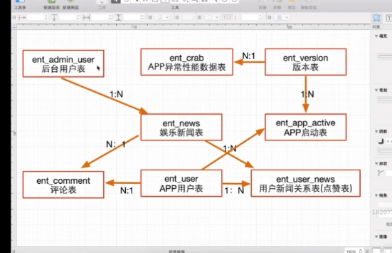

# 课程介绍 （待补充）

本章先讲解课程所含技术点，并演示相关的项目，让小伙伴对课程有个初步的认知，然后再带领小伙伴进行功能的分析，表的ER总关系图

## App项目功能介绍

如何开发完整的app后端
如何应对app后台开发中遇到的难题

### 高安全

- 授权码sign算法
- 登录场景access_user_token 算法
- token 唯一性支持
- API 一次性请求支持

### 高可用

- 玩转restful api 开发流程
- web登录和APP登录异同处
- 阿里大于短信验证解决客户端APP复杂登录场景
- API接口版本解决方案
- APP本地时间和服务器时间一致性解决方案
- 不可预知的API内部异常解决方案
- APP版本升级解决方案
- 利用七牛云解决图片处理基础服务能力
- 基础类库的封装
- 部分PHP设计模式的穿透
- 部分模块提供多种解决方案最后选择最优的方案
- PHP + ajax 实现异步数据交互
- 课程的编码严格遵循PHP代码规范

### 异常检测

- APP端异常、性能监控以及定位解决方案
- 多种APP调试方案（编辑器调试APP、手机调试APP）
- 系统日志问题定位分析

### TP5核心

- TP的路由使用
- 缓存使用
- validate验证机制使用
- 高效的管理TP5的配置文件
- 分页机制
- 日志类的使用
- 上传类的使用
- session会话控制、验证码
- 模板引擎
- vendor下核心类库的安装
- 分析核心框架类库的内核
- 如何编写接口文档

### 适合人群

- 有PHP基础，但是缺少实战项目经验
- 没有APP后端服务开发经验，想在后端服务开发提升
- 一年工作经验，进阶高级工程师

## 项目功能需求分析

- 后台模块
	- 后台登录
	- 退出登录
	- 娱乐新闻管理
		- 添加功能（图片上传：本地、七牛云）
		- 列表（搜索、分页）
		- 修改状态、删除文章等
		- 编辑功能
	- 管理员管理
		- 增删改查
		- 权限控制
		
- APP模块
	- 版本升级功能
	- 首页接口API
	- 栏目接口
	- 栏目列表页数据接口
	- 详情页接口
	- 相关推荐
	- 内容搜索
	- 评论、点赞
	- 登录功能
		- 手机号 + 验证码
		- 手机号 + 密码
		- 个人中心
	- 消息推送服务
	- APP端异常分析定位等

## 数据表ER关系总图对应讲解

