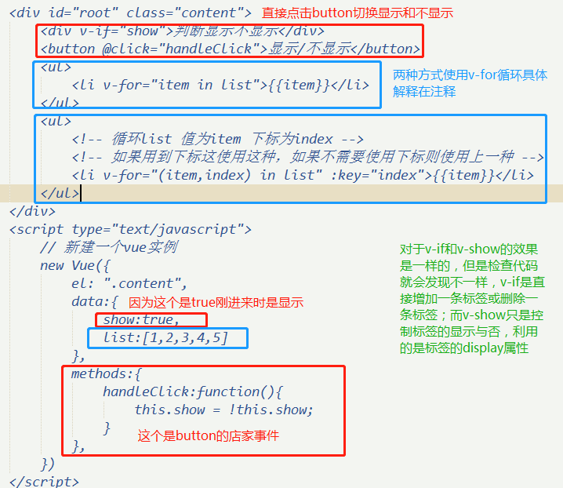

# Vue基础语法

## 创建vue实例

[vue的安装](https://cn.vuejs.org/v2/guide/installation.html)

vue安装：这里直接用 `<script>` 引入，使用开发版本

> 进入vue的安装点击开发版本，把里面的代码复制然后建立一个vue.js文件，粘贴进去，然后保存到项目文件内

## 挂载点  模板 和实例

- 在script中 new vue({}) 就是创建一个实例
- vue实例里面的el属性 表示挂载点 ,el的值对应的是标签里面对应名称的home节点
- vue实例里面的template属性，表示模板，也是对应挂载点里面的所有内容，如果挂载点里面存在内容也会被template的值替换掉

## Vue实例中的数据 事件 和方法

 - v-text 对应html标签不会转译
 - v-html 直接转译html标签
  - 如果对应的内容不带html标签，则返回效果一样
 - v-on:click="handleClick" 绑定事件
  - 简写：@click="handleClick"

```html
<!DOCTYPE html>
<html lang="en">
	<head>
		<meta charset="UTF-8">
		<title>Vue入门</title>
		<script src="./vue.js"></script>
	</head>
	<body>
		<div id="root" class="content">
			{{msg}}
			
			<h1 v-text="number"></h1>
			<h1 v-html="number"></h1>
			
			<h1 v-text="content"></h1>
			<h1 v-html="content"></h1>
			
			<div  v-on:click="handleClick">
				{{clickContent}}
			</div>
		</div>
		<script type="text/javascript">
			// 新建一个vue实例
			new Vue({
				// el 属性 表示挂载点 ,el的值对应的是标签里面对应名称的home节点
				el: ".content", 
				// template 属性，表示模板，也是对应挂载点里面的所有内容，如果挂载点里面存在内容会被替换掉
				template:'<div  v-on:click="handleClick">{{clickContenttemplate}}</div>', 
				// data 属性,表示标签里面对应的值,可以自定义名称
				data:{
					msg:"hello world",
					number:123,
					content:"<h2>123</h2>",
					clickContent:"clickContent",
					clickContenttemplate:"clickContenttemplate",
				},
				// methods 属性, 里面绑定的是模板里面的执行事件产生的效果对应的函数
				methods:{
					handleClick:function(){
						// alert(123)
						this.clickContenttemplate = 'world'
					}
				}
			})
		</script>
	</body>
</html>
```

## Vue中的属性绑定和双向数据绑定

v-bind:title 绑定title属性
简写：:title

v-model="content"  双向绑定


## Vue中的计算属性和侦听器

- 计算属性使用：computed  对于任何复杂逻辑都可以使用计算属性
	- 只在相关依赖发生改变时它们才会重新求值(这就意味着只要 fullName 没有发生改变，多次访问 reversedMessage 计算属性会立即返回之前的计算结果，而不必再次执行函数)。
	
- 侦听器使用：watch  观察和响应 Vue 实例上的数据变动 
	- 当需要在数据变化时执行异步或开销较大的操作


## v-if v-show v-for

- v-if：控制标签的存在与否
- v-show： 控制标签的显示与否
- v-for： 控制一组数据，通过v-for循环显示  把一个数组对应为一组元素



# Vue中的组件

## TodoList功能开发

利用v-model双向绑定和@click点击事件以及v-for循环事件实现todolist的功能开发

把input提交的数据在下面li标签中显示出来，同时清空input表单里面的内容

```html
// 补全上下的结构可以测试查看提交效果
···
<div id="root">
	<input v-model="inputValue" />
	<button @click="handleClick">提交</button>
	<ul>
		<li v-for="(val,key) in list" :key="key">{{val}}</li>
	</ul>
</div>
<script type="text/javascript">
	new Vue({
		el: "#root", 
		data:{
			inputValue:'',
			list:[]
		},
		methods:{
			handleClick:function(){
				this.list.push(this.inputValue);
				this.inputValue = ''
			}
		},
	})
</script>
···
```

## TodoList组件拆分

组件是页面的一部分

定义一个全局组件，实现上面的功能效果

```html
···
<div id="root">
	<input v-model="inputValue" />
	<button @click="handleClick">提交</button>
	<ul>
		<todo-item v-for="(val, key) in list" :key="key" :content="val">
		</todo-item>
	</ul>
</div>
<script type="text/javascript">
	// 定义一个全局组件 组件名为todo-item 对应最外层模块里面的标签名
	Vue.component("todo-item",{
		// 获取content的值
		props:['content'],
		template:"<li>{{content}}</li>"
	})
	new Vue({
		el: "#root", 
		data:{
			inputValue:'',
			list:[]
		},
		methods:{
			handleClick:function(){
				this.list.push(this.inputValue);
				this.inputValue = ''
			}
		},
	})
</script>
···
```

## 组件和实例的关系

每一个组件就是一个vue实例，同样的每一个vue实例都是一个组件

## 实现todolist的删除功能

父组件向子组件传值是通过属性传值的


# Vue-cli的使用 

## Vue-cli 的简介与使用

[vue的安装](https://cn.vuejs.org/v2/guide/installation.html)

Vue-cli安装：

1、命令行工具

安装命令全局安装vue-cli

npm install --global vue-cli

2、安装完成 
创建一个机遇webpack 模板的新项目
vue init webpack todolist 
使用webpack模板创建一个todolist的项目（一路回车）
